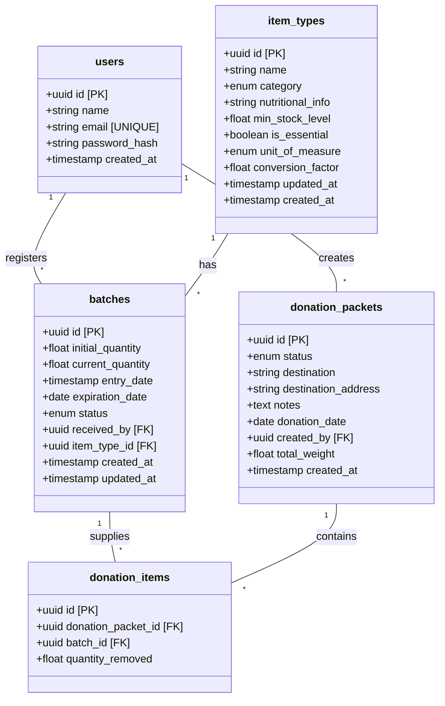
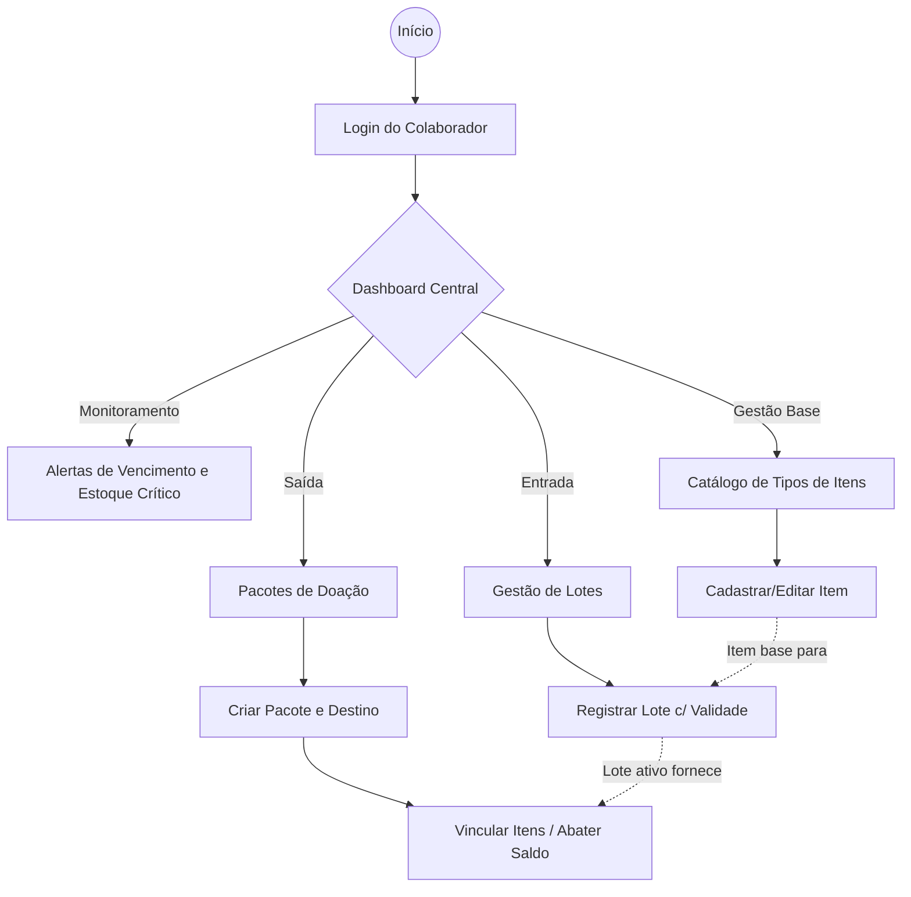

# ONGConecta - Controle de Estoque para ONGs

Este repositório contém o código-fonte do **ONGConecta**, um sistema desenvolvido para facilitar o gerenciamento de estoque, monitoramento de validade e distribuição de doações para Organizações Não Governamentais.
---

## Instalação e Execução

Para rodar a aplicação localmente, você precisará clonar o repositório duas vezes (uma instância para o backend e outra para o frontend) e executar os ambientes separadamente.

### 1. Clonando o Sistema
Abra o seu terminal e clone o repositório em duas pastas diferentes

### 2. Rodando o Backend
Em um terminal, acesse a pasta do backend e instale as dependências:
```bash
cd backend
npm install
```

Antes de rodar as operações no banco e iniciar o servidor, crie um arquivo `.env` na raiz da pasta `backend` contendo as variáveis de ambiente necessárias. Exemplo:
```env
NODE_ENV=development
DATABASE_URL="./db/app.db"
ADMIN_PASSWORD="[PASSWORD]"
```

Em seguida, execute as migrations e a seed para preparar o banco de dados e inicie o servidor:
```bash
npm run knex -- migrate:latest
npm run knex -- seed:run
npm run dev
```
O banco de dados SQLite será estruturado e populado com dados iniciais localmente. O servidor iniciará (geralmente na porta `3333`).

### 3. Rodando o Frontend
Em um segundo terminal, acesse a pasta do frontend, instale as dependências e inicie o Vite:
```bash
cd frontend
npm install
npm run dev
```
A interface do usuário ficará disponível no seu navegador (geralmente em `http://localhost:5173`).

---

## 1. Visão Geral do Sistema
O **ONGConecta** é um sistema web focado em otimizar e rastrear o inventário de ONGs. Ele permite que os colaboradores da instituição mantenham um controle rigoroso sobre os insumos recebidos, rastreando categorias, quantidades e, principalmente, **datas de validade** de cada doação. O sistema atende a gestores e voluntários que precisam de uma ferramenta centralizada para dar entrada em lotes de doações, receber alertas automáticos sobre itens próximos ao vencimento e registrar detalhadamente as saídas por meio de pacotes de doações destinados a comunidades ou indivíduos.

## 2. Arquitetura do Projeto
A arquitetura do sistema adota um padrão de **monorepo**, onde os projetos de *Frontend* e *Backend* coabitam no mesmo repositório raiz, embora em subdiretórios distintos. Essa organização unifica o versionamento e simplifica o fluxo de desenvolvimento.

- **Frontend (`/frontend`)**: Aplicação SPA (Single Page Application) construída em **React.js** usando o bundler **Vite**. O roteamento interno é controlado via estado na própria interface e o visual emprega **Vanilla CSS**.
- **Backend (`/backend`)**: API RESTful desenvolvida em **Node.js**, **Fastify** e **TypeScript**. O acesso aos dados se dá pelo **Knex.js** operando sobre um banco de dados relacional embutido (**Better-Sqlite3**) e a comunicação cliente-servidor é gerida por cookies para controle de sessão.

### Diagrama de Classes (Banco de Dados)

O diagrama abaixo detalha a estrutura de banco de dados e os atributos das entidades do sistema:



## 3. Principais Fluxos do Sistema

1. **Autenticação e Sessão**: O colaborador faz login informando e-mail e senha. O backend valida os dados, gerando um cookie de sessão (*Session ID*) que autoriza o consumo das rotas protegidas pelo tempo estipulado.
2. **Catálogo de Itens**: O usuário cadastra o portfólio de itens com os quais a ONG atua (ex: Arroz, Feijão). Cada item define seu nome, categoria e nível de estoque mínimo aceitável.
3. **Entrada de Lotes**: Ao receber uma doação, o colaborador cria um lote vinculado a um tipo de item do catálogo, detalhando a quantidade que chegou e sua respectiva data de vencimento.
4. **Montagem de Pacotes de Doação**: Quando os insumos vão ser distribuídos, o usuário cria um "Pacote de Doação" com um destino. Ele então atrela itens específicos (saídos de lotes ativos) a este pacote. O sistema imediatamente deduz a quantidade do lote original e bloqueia o uso de produtos vencidos na doação.
5. **Inteligência de Estoque (Dashboard)**: O fluxo principal exibe resumos quantitativos (itens em falta) e qualitativos (lotes que estão vencendo num horizonte próximo), permitindo que a ONG tome ações para escoar os suprimentos antes da perda.

O fluxograma abaixo apresenta de maneira simplificada a jornada e as principais operações do usuário dentro da aplicação:



---

## 4. Documentação das Rotas da API

As rotas da API rodam a partir de prefixos modulares. Os payloads e respostas seguem o formato JSON.

### `[POST] /auth/login`
- **Descrição**: Autentica o colaborador no sistema.
- **Payload**: Objeto com as credenciais de acesso do usuário.
- **Resposta (200)**: Retorna mensagem de sucesso e define o cookie `sessionId`.

### `[POST] /auth/logout`
- **Descrição**: Encerra a sessão ativa do usuário.
- **Payload**: N/A
- **Resposta (200)**: Retorna confirmação e remove o cookie `sessionId` do navegador.

### `[POST] /items`
- **Descrição**: Cria um novo item base para o catálogo.
- **Payload**: Propriedades do item (nome, categoria, unidade de medida, etc).
- **Resposta (201)**: Objeto detalhando o item criado.

### `[GET] /items`
- **Descrição**: Lista os tipos de itens cadastrados no catálogo, possui filtros com base nos atributos do item.
- **Resposta (200)**: Array de objetos representando os itens.

### `[GET] /items/:id`
- **Descrição**: Busca os detalhes de um item específico do catálogo.
- **Resposta (200)**: Objeto com os detalhes do item.

### `[PUT] /items/:id`
- **Descrição**: Edita as informações de um item específico do catálogo.
- **Payload**: Objeto de item modificado.
- **Resposta (200)**: Objeto do item atualizado.

### `[DELETE] /items/:id`
- **Descrição**: Remove um item do catálogo. A exclusão só é permitida caso não haja lotes dependentes.
- **Resposta (200)**: Mensagem de confirmação da exclusão.

### `[POST] /batch`
- **Descrição**: Registra um lote de entrada de doações.
- **Payload**: Objeto com os atributos do lote.
- **Resposta (201)**: Retorna os dados do lote criado.

### `[GET] /batch`
- **Descrição**: Lista os lotes de entrada registrados, possui filtros com base nos atributos do lote.
- **Resposta (200)**: Array com a listagem dos lotes e quantidades atualizadas.

### `[GET] /batch/:id`
- **Descrição**: Retorna os detalhes de um lote específico.
- **Resposta (200)**: Objeto com as informações do lote.

### `[PATCH] /batch/:id/quantity`
- **Descrição**: Atualiza parcialmente a quantidade disponível de um lote.
- **Payload**: Novo quantidade para o lote.
- **Resposta (200)**: Objeto do lote com a quantidade atualizada.

### `[DELETE] /batch/:id`
- **Descrição**: Apaga um lote específico.
- **Resposta (200)**: Mensagem de confirmação da exclusão.

### `[POST] /donation-packets`
- **Descrição**: Cadastra um pacote/remessa para a saída de doações.
- **Payload**: Dados gerais do destinatário e observações.
- **Resposta (201)**: Retorna os dados do pacote criado.

### `[GET] /donation-packets`
- **Descrição**: Lista os pacotes de saída de doações cadastrados, possui filtros com base nos atributos do pacote.
- **Resposta (200)**: Array contendo os pacotes.

### `[GET] /donation-packets/:id`
- **Descrição**: Retorna os detalhes de um pacote de doação específico.
- **Resposta (200)**: Objeto com as informações do pacote.

### `[PUT] /donation-packets/:id`
- **Descrição**: Atualiza os dados gerais do cabeçalho do pacote.
- **Payload**: Dados do destinatário e observações a atualizar.
- **Resposta (200)**: Objeto do pacote atualizado.

### `[PATCH] /donation-packets/:id/status`
- **Descrição**: Altera explicitamente o status da doação (ex: "Entregue", "Pendente").
- **Payload**: Novo status para o pacote.
- **Resposta (200)**: Objeto do pacote com status atualizado.

### `[DELETE] /donation-packets/:id`
- **Descrição**: Exclui o pacote. Esta ação estorna automaticamente as quantidades dos itens devolvendo-as ao estoque.
- **Resposta (200)**: Mensagem de confirmação da exclusão.

### `[POST] /donation-items`
- **Descrição**: Adiciona itens físicos ao pacote de doação subtraindo-os dos lotes originais.
- **Payload**: Objeto com os atributos do item de doação.
- **Resposta (201)**: Retorna os detalhes do item inserido no pacote.

### `[GET] /donation-items`
- **Descrição**: Lista todos os itens que foram adicionados a pacotes de doações, possui filtros com base nos atributos do item de doação.
- **Resposta (200)**: Array contendo os itens de doação.

### `[GET] /donation-items/:id`
- **Descrição**: Retorna um item de doação específico.
- **Resposta (200)**: Objeto do item na doação.

### `[PATCH] /donation-items/:id/quantity`
- **Descrição**: Atualiza a quantidade do item na doação e ajusta o saldo do lote proporcionalmente.
- **Payload**: Nova quantidade para o item de doação.
- **Resposta (200)**: Objeto do item de doação atualizado.

### `[DELETE] /donation-items/:id`
- **Descrição**: Remove o item do pacote devolvendo a quantidade integralmente ao estoque original (estorno).
- **Resposta (200)**: Mensagem de confirmação da remoção.

---

## 5. Estrutura de Pastas

```text
controle-de-estoque-para-ongs/
├── backend/                  # Ambiente da API Node.js
│   ├── db/                   # Configuração das migrations e banco de dados SQLite local
│   ├── src/                  # Lógica de negócio e configurações base
│   │   ├── env/              # Configurações e validações das variáveis de ambiente (Zod)
│   │   ├── middlewares/      # Interceptadores de requisições (validação de sessão)
│   │   ├── routes/           # Controladores modulares por rota (auth, items, lotes, etc)
│   │   ├── app.ts            # Registro do framework, plugins e middlewares globais
│   │   ├── database.ts       # Instância do Query Builder (Knex)
│   │   └── server.ts         # Script principal (entry point HTTP)
│   ├── knexfile.ts           # Definições das conexões do banco para o CLI
│   └── package.json          # Manifesto de bibliotecas e scripts do backend
│
├── frontend/                 # Aplicação Cliente (Interface Web)
│   ├── src/                  # Componentes e estilos
│   │   ├── App.jsx           # Componente principal responsável pelo estado de navegação
│   │   ├── index.css         # Reset CSS, Design Tokens e estilos globais
│   │   └── *Pages.jsx        # Páginas da aplicação (Dashboard, Items, Lotes, etc)
│   ├── index.html            # Arquivo HTML principal manipulado pelo Vite
│   ├── package.json          # Dependências do framework e linting
│   └── vite.config.js        # Configurações e plugins do servidor de desenvolvimento
│
├── docs/                     # Repositório para anexar o context.md, utilizada pela IA
└── README.md                 # Este documento de apresentação principal
```

---

## 6. Stack
- Backend: Node.js + TypeScript
- Frontend: React.js + MCP Figma
- Testes: Vitest (front e back)
- Versionamento: Git (Repositório configurado)

---

## 7. Padrões de Desenvolvimento

### Versionamento (Git)
- Repositorios: Um para o frontend e outro para o backend
- Branches: Divisao entre ambientes e histórias.
- Padrão de Commits:
    - add: Novas funcionalidades ou arquivos.
    - fix: Correção de erros/bugs.
    - update: Melhorias em códigos ou funções existentes.
    - delete: Remoção de arquivos ou trechos obsoletos.

### Protocolo com IA
1. Contexto: Iniciar sempre detalhando a história de usuário.
2. Especificidade: Cada prompt posterior deve focar em detalhes técnicos únicos.
3. Segurança: Não realizar alterações de imediato no código.
4. Validação: Aprovação humana obrigatória para cada etapa gerada.
5. Agente: Claude Sonnet 4.6

### Reuniões
Uma reunião semanal na sexta às 16:00 (podendo ser mais de uma, se necessário).

---

## 8. Histórias de Usuário (Backlog)

1. **Autenticação de Colaboradores**: O usuário realiza login e logout com e-mail e senha para acessar áreas protegidas do sistema.

2. **Cadastro de tipos de itens**: O usuário pode criar novos itens no catálogo, definindo nome, categoria e informações relevantes.

3. **Manutenção do catálogo de itens**: O usuário pode editar e remover itens existentes, respeitando restrições de uso em lotes.

4. **Registro de Entrada de Lotes**: O usuário registra doações informando quantidade e data de validade para controle de estoque.

5. **Visualização de estoque**: O usuário visualiza os lotes disponíveis com informações como item, quantidade e validade, assim como a informação de um unico lote.

6. **Filtragem de estoque**: O usuário pode filtrar lotes por tipo de item, validade ou outros critérios para facilitar a busca.

7. **Montagem de pacotes de doação**: O usuário seleciona itens de lotes disponíveis para compor um pacote de doação.

8. **Registro de saída de doações**: O sistema registra a saída dos itens, atualiza automaticamente o estoque e associa a um destino.

9. **Dashboard com informações gerais**: O usuário deve visualizar indicadores rápidos com o total de quilos doados por item, acumulado de itens recebidos por período de tempo e alimentos essenciais em falta.

---

## 9. Organização do Time (4 Integrantes)

Para uma entrega eficiente, a divisão ideal seria:

* Backend (João e Luiz Felipe): Focam em Node/Express e Banco de Dados. Responsáveis pelas rotas de estoque, lógica de cálculo de saldos e validações.
* Frontend (Luís e Matheus): Focam em React. Responsáveis pelas tabelas dinâmicas, formulários de entrada/saída e alertas visuais de validade.
